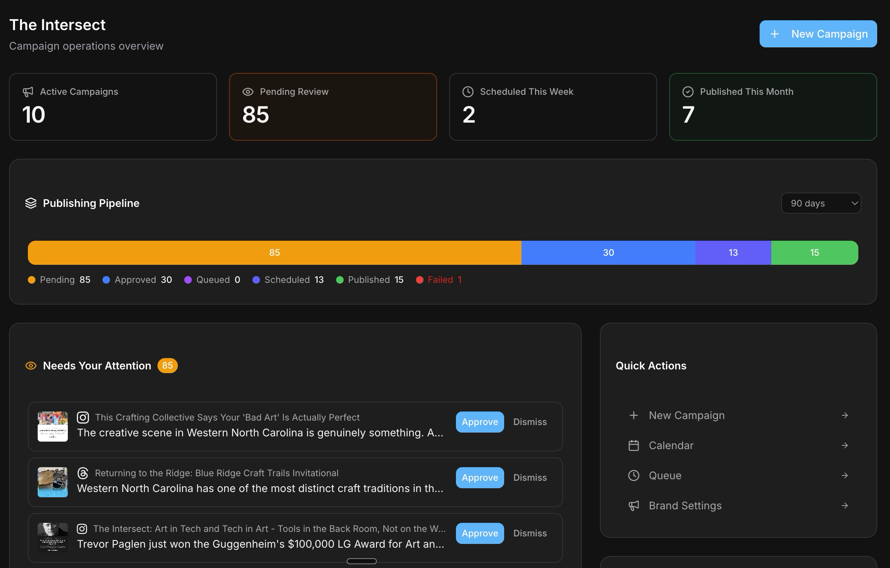
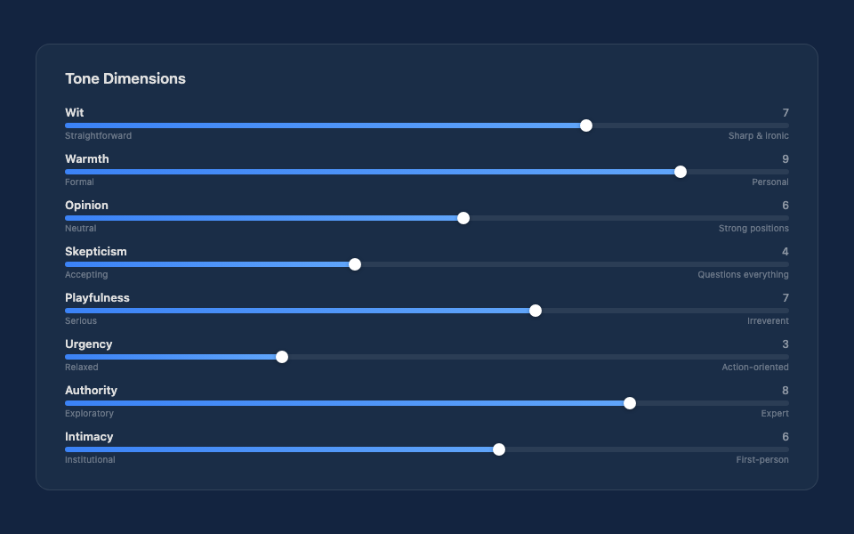
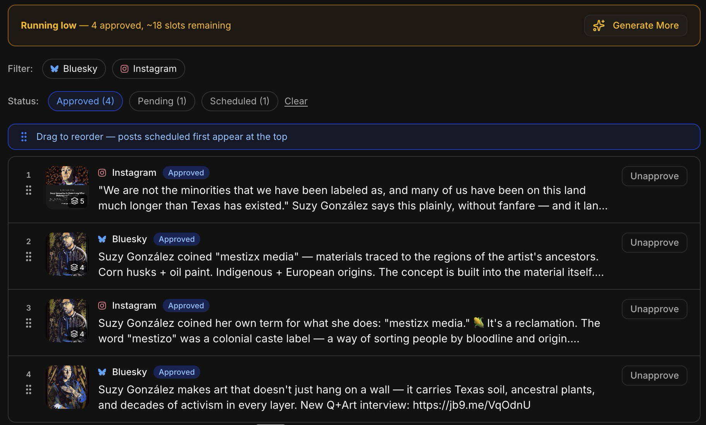

<!-- _class: lead bg-hero -->
<!-- _paginate: false -->

  

# A Marketing Agency in a Box

How one person built a production social media system — and what it means for Vista Growth

  Juergen Berkessel
  April 2026

---

<!-- _paginate: false -->
<!-- _class: bg-dots -->

### Today's Agenda

# What We'll Cover

  

    

    
01

    
PolyWiz Demo

    
A real AI marketing tool — the kind of solution Vista Growth could bring to clients

  

  

    

    
02

    
Strategic Framing

    
Why Vista Growth should advise on navigating structural change, not recommending specific tools

  

  

    

    
03

    
The Boilerplate Path

    
How Jackie can go from building websites to building real applications using AI-assisted development

  

  

    

    
04

    
AI Interview Protocol

    
If time allows — turning the $7,500 audit into a self-service qualification engine (<a href="./interview-protocol.html" style="color: #0199fe; text-decoration: none;">separate deck</a>)

  

---

<!-- _class: bg-glow-orange -->

### The Story

# Why We Built PolyWiz

  

    

Our clients are 501(c)(3) arts organizations — nonprofits running on thin budgets. Their teams were burning enormous time, energy, and money **laboriously producing social media content** — writing posts, reformatting for each platform, managing scheduling, tracking results.

That's time they could spend curating exhibitions, building relationships with artists, engaging their communities. The real work.

So we built PolyWiz — not to replace anyone, but to **free people up** for the work that actually matters.

  

  

  

    

      
PolyWiz Today

      

        
1

        person operating the system
      

      

        
13

        social platforms managed
      

      

        
4

        organizations in production
      

      

        
11

        campaign types running
      

    

  

---

<!-- _class: bg-glow-green -->

### The Real ROI

# It's Not About Cutting Headcount

The early adopters of AI aren't just saving money. They're **expanding what their teams can do.** The ROI story is about increased capabilities, not reduced costs.

  

    

    
BEFORE — WHERE TIME WENT

    

      
Writing posts for 13 platforms

      
Reformatting content per channel

      
Managing scheduling spreadsheets

      
Tracking what was posted where

    

  

  

    <svg width="24" height="24" viewBox="0 0 24 24" fill="none" stroke="var(--a)" stroke-width="2"><polyline points="9 18 15 12 9 6"/></svg>
  

  

    

    
AFTER — WHERE TIME GOES NOW

    

      
Curating exhibitions and shows

      
Building relationships with artists

      
Community engagement and outreach

      
Competing better with sustained social presence

    

  

  
Same team. Same budget. **Dramatically more output and reach.** That's the story early AI adopters are living — and the story Vista Growth's clients will want to hear.

---

<!-- _class: bg-glow -->

### Possibilities

# Where Vista Growth Could Fit

Your clients may not need to build these tools themselves. They may need someone who understands the landscape, vets the solutions, and helps design the transition.

  

    

    <svg width="24" height="24" viewBox="0 0 24 24" fill="none" stroke="var(--a)" stroke-width="1.5"><circle cx="11" cy="11" r="8"/><line x1="21" y1="21" x2="16.65" y2="16.65"/></svg>
    
Evaluate Solutions

    
Tools like PolyWiz already exist. Vista Growth helps clients find, vet, and compare them — not which tool, but **what criteria**, how to pilot, how to measure.

  

  

    

    <svg width="24" height="24" viewBox="0 0 24 24" fill="none" stroke="var(--g)" stroke-width="1.5"><path d="M17 21v-2a4 4 0 0 0-4-4H5a4 4 0 0 0-4 4v2"/><circle cx="9" cy="7" r="4"/><path d="M23 21v-2a4 4 0 0 0-3-3.87"/><path d="M16 3.13a4 4 0 0 1 0 7.75"/></svg>
    
Redeploy Teams

    
5 content writers don't become 0. They become **2 strategists + 3 community managers**. Vista Growth designs the retraining and the transition plan.

  

  

    

    <svg width="24" height="24" viewBox="0 0 24 24" fill="none" stroke="var(--y)" stroke-width="1.5"><rect x="3" y="3" width="7" height="7"/><rect x="14" y="3" width="7" height="7"/><rect x="3" y="14" width="7" height="7"/><rect x="14" y="14" width="7" height="7"/></svg>
    
Partner & Integrate

    
Bring **vetted solution partners** — like PolyWiz for social media automation — to clients who need them. Revenue share, not just advice.

  

---

<!-- _class: bg-glow-green -->

### PolyWiz

# Not a Prototype. Production.

  

    

    
13

    
PLATFORMS

    
Instagram, Facebook, X, LinkedIn, Threads, Bluesky, TikTok, Pinterest, YouTube, Tumblr, Mastodon, Reddit, Google Business

  

  

    

    
4

    
ORGANIZATIONS

    
Running production campaigns right now — real posts, real platforms, real approval workflows

  

  

    

    
11

    
CAMPAIGN TYPES

    
Newsletter, Exhibition, Artist Profile, Podcast, Event, Open Call, and more

  

  

    

    
1

    
PERSON

    
Built and operated by one person using AI-assisted development

  

  

---

<!-- _class: bg-dots -->

### PolyWiz — Brand Voice

# 8-Dimension Voice System

  

    
Every organization sounds different. PolyWiz doesn't use one-size-fits-all prompts — it calibrates across **8 tonal dimensions** so that each brand's voice is distinct and consistent across all platforms.

  Wit
  Warmth
  Opinion
  Skepticism
  Playfulness
  Urgency
  Authority
  Intimacy

Each slider ranges 0-10. The AI adapts its writing style per brand, per platform, per post type.

  

  

    
  

---

<!-- _class: bg-glow-green -->

### PolyWiz — Human Control

# Approval Queue

  

    

**Nothing auto-fires.** Every AI-generated post enters the approval queue as a draft.

Humans review, edit, approve, or reject. The AI is the engine — the humans are the drivers.

Your team stays in control. The AI handles the production grind — your people focus on engagement, community, and creative strategy.

    

      

        <svg width="14" height="14" viewBox="0 0 24 24" fill="none" stroke="var(--g)" stroke-width="1.5"><path d="M22 11.08V12a10 10 0 1 1-5.93-9.14"/><polyline points="22 4 12 14.01 9 11.01"/></svg>
        Key principle:
        AI generates, humans decide
      

    

  

  

    
  

---

<!-- _class: lead bg-hero -->

Live Demo

# Let Me Show You

<a href="https://polywiz.polymash.com" target="_blank" style="font-family: 'Raleway'; font-weight: 300; font-size: 0.85em; color: var(--a); margin-top: 12px; max-width: 500px; text-decoration: none; display: block;">polywiz.polymash.com</a>

---

<!-- _class: bg-glow-gold -->

### Same Philosophy

# Different Packaging

  

    

    
Steve's World

    
Mid-Market B2B

    

      "**AI-powered**" is a selling point. Clients want to hear it. The language of transformation, automation, and AI governance resonates.
    

    

      Lead with AI
    

  

  

    
VS

  

  

    

    
My World

    
501(c)(3) Arts Organizations

    

      "**AI-powered**" triggers skepticism. Arts orgs don't want a robot writing about their artists. PolyWiz leads with sustained presence and human approval.
    

    

      AI Under the Hood
    

  

  
Same philosophy — <strong>AI frees people up rather than replacing them</strong> — different audience, different framing. This nuance is something Vista Growth's clients will face too.

---

<!-- _class: bg-glow-orange -->

### The Strategic Point

# Don't Recommend Tools. Navigate Change.

This space moves so fast that recommending specific AI tools is a losing game. Whatever you recommend in April will be surpassed by July. Tools like PolyWiz will be **commonplace within a year**.

What Vista Growth should advise on instead

  

    

      <svg width="18" height="18" viewBox="0 0 24 24" fill="none" stroke="var(--a)" stroke-width="1.5"><path d="M17 21v-2a4 4 0 0 0-4-4H5a4 4 0 0 0-4 4v2"/><circle cx="9" cy="7" r="4"/></svg>
      

        
Redeploy People

        
What do your marketers do when AI handles content generation?

      

    

    

      <svg width="18" height="18" viewBox="0 0 24 24" fill="none" stroke="var(--a)" stroke-width="1.5"><rect x="3" y="3" width="7" height="7"/><rect x="14" y="3" width="7" height="7"/><rect x="3" y="14" width="7" height="7"/><rect x="14" y="14" width="7" height="7"/></svg>
      

        
Restructure Teams

        
5 content writers → 2 strategists + 3 community managers

      

    

    

      <svg width="18" height="18" viewBox="0 0 24 24" fill="none" stroke="var(--a)" stroke-width="1.5"><circle cx="11" cy="11" r="8"/><line x1="21" y1="21" x2="16.65" y2="16.65"/></svg>
      

        
Evaluate & Adopt

        
Not which tool, but what criteria, how to pilot, how to measure

      

    

  

  

    

      <svg width="18" height="18" viewBox="0 0 24 24" fill="none" stroke="var(--a)" stroke-width="1.5"><path d="M13 2L3 14h9l-1 8 10-12h-9l1-8z"/></svg>
      

        
Compete Better

        
Your competitors will have AI marketing. Will you?

      

    

    

      <svg width="18" height="18" viewBox="0 0 24 24" fill="none" stroke="var(--a)" stroke-width="1.5"><polyline points="22 12 18 12 15 21 9 3 6 12 2 12"/></svg>
      

        
Manage the Human Side

        
Retraining, redeployment, morale, the internal narrative

      

    

    

      
"I'm not telling you to use PolyWiz. I'm showing you what one person built. Your clients need someone to help them navigate what happens when these tools exist."

    

  

---

<!-- _class: bg-dots -->

### The Origin Story

# It Started with a YouTube Video

  

    

**Bart Slodyczka** published a video called "Build 10X Faster With This Simple Claude Code Workflow."

His key insight: give an AI coding assistant a well-structured starting point — authentication, database, UI components, API patterns — and it can build **real applications**, not just websites.

I took that idea, forked the boilerplate, and built <a href="https://polywiz.polymash.com" target="_blank" style="color: var(--a); text-decoration: none;">PolyWiz</a> as well as <a href="https://visibilitylabs.polymash.com" target="_blank" style="color: var(--a); text-decoration: none;">Visibility Labs</a>.

  

    <svg width="14" height="14" viewBox="0 0 24 24" fill="none" stroke="var(--a)" stroke-width="1.5"><path d="M13 2L3 14h9l-1 8 10-12h-9l1-8z"/></svg>
    The leap:
    From building websites → building applications
  

  

  

    

      
The Boilerplate Stack

      

        <svg width="8" height="8" viewBox="0 0 8 8"><circle cx="4" cy="4" r="4" fill="var(--a)"/></svg>
        Next.js + React + TypeScript
      

      

        <svg width="8" height="8" viewBox="0 0 8 8"><circle cx="4" cy="4" r="4" fill="var(--a)"/></svg>
        Tailwind CSS + shadcn/ui
      

      

        <svg width="8" height="8" viewBox="0 0 8 8"><circle cx="4" cy="4" r="4" fill="var(--a)"/></svg>
        Authentication & login flows
      

      

        <svg width="8" height="8" viewBox="0 0 8 8"><circle cx="4" cy="4" r="4" fill="var(--a)"/></svg>
        Supabase or Airtable backend
      

      

        <svg width="8" height="8" viewBox="0 0 8 8"><circle cx="4" cy="4" r="4" fill="var(--a)"/></svg>
        Dashboard + sidebar navigation
      

      

        <svg width="8" height="8" viewBox="0 0 8 8"><circle cx="4" cy="4" r="4" fill="var(--a)"/></svg>
        Deploy-ready for Vercel
      

    

  

---

<!-- _class: bg-glow -->

### For Jackie

# Feature Prompting

Instead of writing code line by line, you describe features to Claude Code and it builds them against the boilerplate's architecture.

  

    

      

      
BEFORE — Website Level

      

        
// Static pages

        
// Contact forms

        
// Content updates

        
No database. No users.

        
No application state.

      

    

  

  

    <svg width="24" height="24" viewBox="0 0 24 24" fill="none" stroke="var(--a)" stroke-width="2"><polyline points="9 18 15 12 9 6"/></svg>
  

  

    

      

      
AFTER — Application Level

      

        
"Add a survey form that

        
saves responses to Supabase"

        
→ Working feature in minutes

        
→ Auth, DB, UI — all included

      

    

  

  
Jackie already builds with Claude Code. The boilerplate is the bridge — it provides the patterns so AI fills in your specific business logic. Authentication, login, user management, role-based access are **solved problems** baked into the template.

---

<!-- _class: bg-glow-green -->

### The Opportunity

# AI Transformation Audit — As a Built Tool

  

    
WHAT YOU HAVE NOW

    
A **$7,500** consulting engagement delivered over 2 weeks. Current state assessment, AI Opportunity Matrix, ROI projections, technology recommendations, 90-day action plan.

    
Manual. High-touch. Doesn't scale.

  

  

  

    
WHAT IT COULD BECOME

    
A self-service assessment tool at **audit.vistagrowth.ai**. Conversational AI interview, AI-scored results, personalized report, CTA to book the full engagement.

    
Qualified leads on autopilot.

  

  

    
PHASE 1 — Qualification

    
15-min conversational AI interview (audio-only). Adaptive follow-ups. AI-scored readiness. Branded PDF report. CRM integration.

    
70-90% completion rate vs 10-30% for forms

  

  

    
PHASE 2 — Organizational

    
Multiple stakeholders take interviews independently. System generates organizational rollup. Divergence reveals alignment issues.

    
A consultable finding itself

  

  

    
PHASE 3 — Full Platform

    
Client portal with audit findings, progress tracking against 90-day plan, ongoing monitoring.

    
Aspirational — build after Phase 1 proves out

  

---

<!-- _class: bg-glow-gold -->

### Credibility

# The Difference It Makes

  

    
Without a Built Tool

    

      <svg width="44" height="44" viewBox="0 0 24 24" fill="none" stroke="var(--r)" stroke-width="1.5"><circle cx="12" cy="12" r="10"/><line x1="15" y1="9" x2="9" y2="15"/><line x1="9" y1="9" x2="15" y2="15"/></svg>
    

    
"Trust us, we know AI."

    
Decks, whitepapers, and promises

  

  

    <svg width="28" height="28" viewBox="0 0 24 24" fill="none" stroke="var(--m)" stroke-width="1.5"><polyline points="9 18 15 12 9 6"/></svg>
  

  

    
With a Built Tool

    

      <svg width="44" height="44" viewBox="0 0 24 24" fill="none" stroke="var(--g)" stroke-width="1.5"><path d="M22 11.08V12a10 10 0 1 1-5.93-9.14"/><polyline points="22 4 12 14.01 9 11.01"/></svg>
    

    
"Trust us, we build AI tools. Try one."

    
Experience over explanation

  

  
The most credible navigators of structural change are the ones who've **actually made the journey themselves**.

---

<!-- _class: bg-grid -->

### Getting Started

# Next Steps for Jackie

  

    
1

    

      
Watch Bart's Video

      
30 min — understand the feature-prompting workflow that made PolyWiz possible

    

    

      30 min
    

  

  

    
2

    

      
Clone the Supabase Boilerplate

      
Get it running locally — instant Next.js app with auth, database, dashboard

    

    

      1 hour
    

  

  

    
3

    

      
Try One Feature Prompt

      
"Add a 10-question survey form that saves responses to Supabase" — see what happens

    

    

      1 hour
    

  

  

    
4

    

      
Think About the AI Transformation Audit

      
Your entry product, well-defined, would immediately differentiate Vista Growth

    

    

      First Project
    

  

---

<!-- _class: lead bg-hero -->
<!-- _paginate: false -->

# PolyWiz Is Evidence. Not Prescription.

Vista Growth's job isn't to build PolyWiz for clients — it's to help clients navigate a world where PolyWiz exists.

  

    
MARKETING SITE

    <a href="https://polywiz.polymash.com" target="_blank" style="font-size: 0.65em; color: var(--a); margin-top: 2px; text-decoration: none; display: block;">polywiz.polymash.com</a>
  

  

    
BART'S VIDEO

    <a href="https://www.youtube.com/watch?v=uHpUVBA8dWE" target="_blank" style="font-size: 0.65em; color: var(--a); margin-top: 2px; text-decoration: none; display: block;">Build 10X Faster — YouTube</a>
  

  

    
BOILERPLATE REPOS

    <a href="https://github.com/JuergenB/polymash-nextjs-supabase-shadcn-boilerplate" target="_blank" style="font-size: 0.58em; color: var(--a); margin-top: 2px; text-decoration: none; display: block;">Supabase Boilerplate</a>
    <a href="https://github.com/JuergenB/polymash-nextjs-airtable-boilerplate" target="_blank" style="font-size: 0.58em; color: var(--a); margin-top: 2px; text-decoration: none; display: block;">Airtable Boilerplate</a>
  

